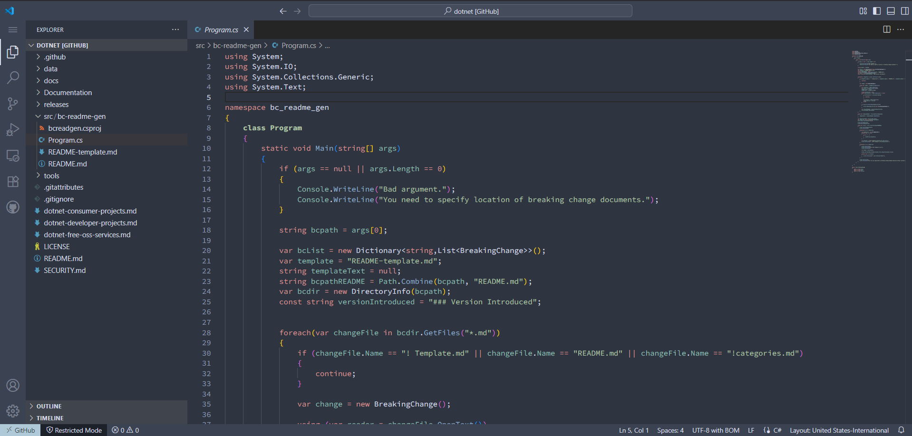

# Nord Pastel

**Nord Pastel** is a cozy twist on the classic **Nord theme** for Visual Studio Code. It keeps all the clean, fresh vibes you love but softens things up with gentle pastel colors — perfect if you want a calm, easy-on-the-eyes coding setup.

## Features

- Soft pastel colors inspired by Nord’s palette
- Better highlighting for things like methods and variables, so your code stands out just right
- A chill vibe that helps you focus during those long coding sessions
- Works great with lots of programming languages

## Preview

## How to get it

1. Open VSCode and search for `Nord Pastel` in the Extensions Marketplace.
2. Install it, then pick it as your color theme.

Enjoy a calm and stylish coding experience with **Nord Pastel**!

Nord Pastel is based on [Nord](https://marketplace.visualstudio.com/items?itemName=arcticicestudio.nord-visual-studio-code) by [arcticicestudio](https://marketplace.visualstudio.com/publishers/arcticicestudio) 

---
